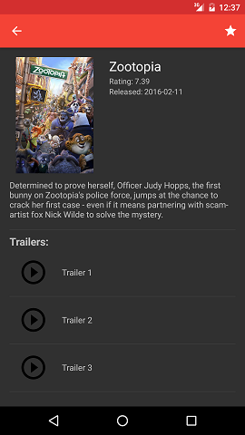
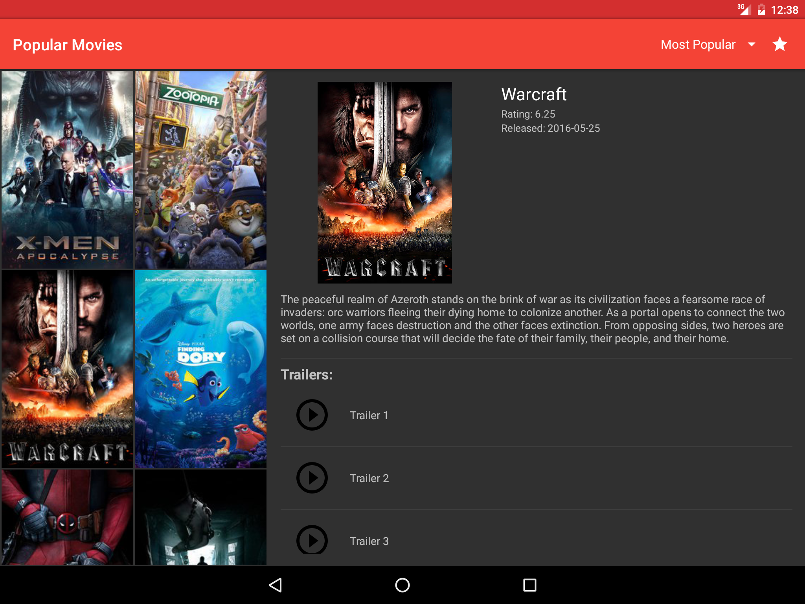

# Popular-Movies

This app allows users to discover the most popular movies playing.

Movie information is gathered from https://www.themoviedb.org/

An API key is needed to run this code.  You can sign up for an account and request for a key at https://www.themoviedb.org/account/signup  
The API key needs to be stored in the global gradle.properties file found in the .gradle path in your root directory:   $root/.gradle/gradle.properties (create file if not found)  
TheMovieDbApiKey="API_KEY_HERE"

- Users will be presented with a grid arrangment of movie posters.
- Users can change sort order of movies using a dropdown setting (Most Popular, Top Rated, Favorites).
- By tapping on a movie poster, users will be presented with a detailed description screen of that movie that includes:
   - original title
   - plot synopsis
   - user ratings
   - release date
   - trailers
   - reviews
- Users can favorite a movie on the detail screen which adds the movie to a locally stored database.

- Tablet landscape will have the grid selection on the left and the movie details on the right.

